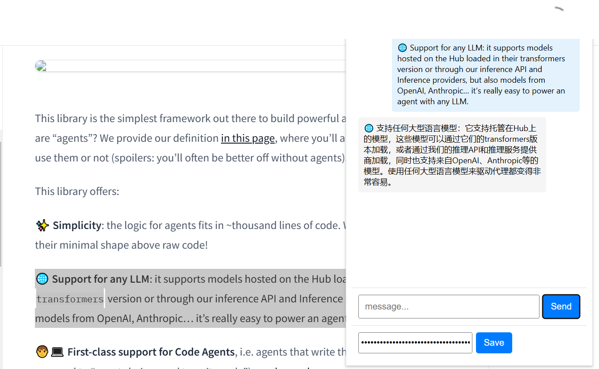

# LLM Translation Assistant  

[](LICENSE)  
[](https://www.python.org/)  
[](https://huggingface.co/)  

**LLM Translation Assistant** 是一个基于大型语言模型（LLM）的 Google 插件，旨在为用户提供便捷的网页内容翻译服务。它的核心功能是允许用户与大模型进行简单对话（无历史聊天记录），但专注于 **免费** 翻译网页中的英文材料，帮助用户快速理解外文内容，打破语言障碍。开发的初衷是解决传统翻译工具（如 Google 翻译）在专业术语、上下文理解以及长文本翻译中的局限性，同时为用户提供一个轻量级、无需额外付费的翻译解决方案。

---

## 功能特性  

- **多场景支持**：支持技术文档、日常对话、文化隐喻等多种翻译场景。  
- **代码友好**：可处理JavaScript等编程语言中的注释和字符串翻译，保留代码功能完整性。  
- **格式保留**：自动保留原文格式（如列表、标题、特殊符号等）。  
- **本地化转换**：自动转换数字和单位（如“3.1 miles” → “5公里”）。  
- **简洁高效**：直接输出翻译结果，不添加额外解释或内容。  

---

## 快速开始  

### 安装步骤  

**1. 克隆本仓库：**
   ```bash
   git clone https://github.com/jinhongzou/llm-translation-assistant.git
   cd llm-translation-assistant
   ```

**2. 配置Model ID和API密钥：**  
   我们插件采用的是硅基流动（siliconflow）平台的在线大模型，使用期请替换自己的model ID和apikey。位于在`popup.js` 文件中：  
   ```js
      const response = await fetch('https://api.siliconflow.cn/v1/chat/completions', options);
   ```
   ```js
      const apiKey = "sk-rxxxxxxxxxx"; 
   ```
   ```js
      model: "Qwen/Qwen2.5-7B-Instruct",
   ```

**3. 插件安装**
-   1.打开Chrome浏览器，输入 chrome://extensions/ 地址。
-   2.开启右上角的***开发者模式***。
-  3.点击***加载已解压的扩展***，选择 translation-assistant 文件夹（可以拖拽文件夹到**拓展程序**）。
-  4.插件加载完成后，会出现一个图标，即可安装完成


### 使用方法

***对话模式：*** 点击google右上角的***扩展程序***，选择translation-assistant。在***message***中输入你的问题，点击***Send***按钮进行对话。
***翻译模式：*** 选中要翻译的英文短句，右键单击，在弹出提示框中选择***translation-assistant***，点击***Send***按钮进行翻译。



---
## 如何获取免费的大语言模型API


推荐使用***硅基流动（https://siliconflow.cn）*** 公司的在线大模型平台，目前公司有三个产品siliconCloud、siliconLLm、OneDiff 。提供市面上大多数的主流模型，最关键是***免费***。免费的模型涵盖文本生成、向量&重排序模型、图片生成、多模态大模型 等各种模型。
网站提供提供一站式模型服务，这个比较爽，大家可以通过我提供邀请码连接来感受这个免费的api模型服务。也可以通过官方自己注册一个账号。

***邀请码***：Sim6qDA1
***要求链接***：https://cloud.siliconflow.cn/i/Sim6qDA1

